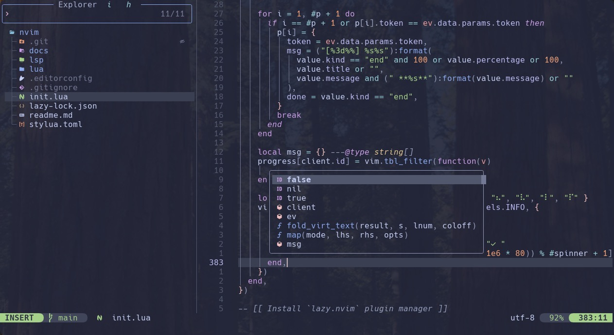

[][/]
[][/]
[][/]

# Neovim PDE Config

100% Lua config 🥳

This is my personal config and as such contains everything I want, set up the way I want it. I am a
strong believer in the idea that to get the most out of Neovim you should set it up yourself from
scratch and create your ideal Personal Development Environment. That being said, looking at other
people's configs is a fantastic way to find snippets for functionality you wish to have in your own
config. That is exactly the way I created mine so please feel free to copy anything you see here.

## Dependencies

- neovim >= 0.11

## Installation

### Clone config:

`git clone --depth=1 https://github.com/kalvinpearce/nvim ~/.config/nvim`

### Check health for Dependencies

Running `:checkhealth` should give a nice list of all the utilities that are missing. Some of these
are optional but a lot of them add very important functionality.

[/]: https://github.com/kalvinpearce/nvim/
