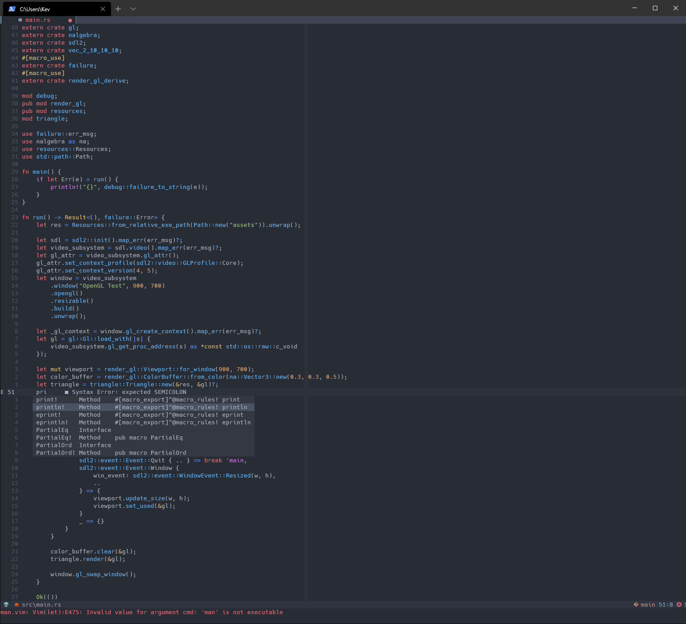

[][/]
[][/]
[][/]

### Attention

This is a complete port of old nvim config for WSL linux and has been rewritten
in lua 100%

# NeoVim Config

This is very much a work in progress. As someone coming from heavy use of VSCode
this config aims to bring many familiar utils and handy features into vim mainly
for C#/Unity and Rust development.

Currently this is being developed for Windows (to support omnisharp) but will be
supporting linux soon too (most things should work on linux already out of the
box)

## Why not just use VSCode?

Well I really like the idea of vim and think the customizability and speed that
you can achieve with it is quite amazing but every time I gave it a go, I always
felt like I was trying to force it. Using VSCode's vim plugin always felt like I
was trying to get it to do something it didn't want to. It was close but never
perfect. However this time I bit the bullet and went for a complete vim solution
and this is what I ended up with so far.

[/]: https://github.com/kalvinpearce/nvim/
